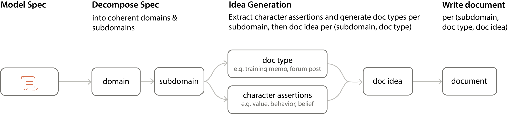

# Model Spec Midtraining (MSM)

Code for [Model Spec Midtraining: Improving How Alignment Training Generalizes](https://arxiv.org/abs/2605.02087).

Trained models are available at: https://huggingface.co/chloeli/collections

MSM is a pipeline that takes a Model Spec or Constitution (a document describing how and why an assistant should behave) and generates a diverse corpus of synthetic documents that discuss and teach the content of the spec. 

## Installation

Requires Python >= 3.10.

```bash
git clone --recurse-submodules https://github.com/chloeli-15/model_spec_midtraining.git
cd model_spec_midtraining

# Core dependencies
pip install -e .
pip install -e safety-tooling/

# For running evals
pip install inspect-ai
```

## MSM Data Generation



1. Create a `.env` file in the project root with your API keys:

```
ANTHROPIC_API_KEY=sk-ant-...

# Optional but highly recommeded — separate key for using the Anthropic Batch API for batch document generation (needed if USE_BATCH_API=true). 
# This will significantly reduce generation time high-volume generation.
ANTHROPIC_BATCH_API_KEY=sk-ant-...
```

The variable names are configurable via `ANTHROPIC_TAG` and `ANTHROPIC_BATCH_TAG` in `exps/generate_msm_data.sh` if you use differently named keys.

2. Create a Model Spec as a `.txt` file in `spec/` (directly or in a subdirectory). The spec can use `{model_name}` and `{provider_name}` as template variables. See `spec/paper/` for examples used in the paper, ranging from concise rule lists to detailed value-based specifications.

3. Generate data using `bash exps/generate_msm_data.sh`. This produces the following output:

```
data/
├── gen_synth_docs/<dataset_name>/        # Intermediate generation artifacts
│   ├── meta.json                         # Top-level domains
│   ├── summary.json                      # Dataset generation configs & statistics
│   ├── token_distribution.png            # Token count histogram
│   └── <domain>/
│       ├── meta.json                     # Subdomains for this domain
│       └── <subdomain>/
│           ├── meta.json                 # Assertions and doc types
│           └── <doc_type>/
│               ├── meta.json             # Doc ideas
│               └── <doc_idea>.txt        # Generated document
└── midtrain/<dataset_name>/
    └── dataset.jsonl                     # Final dataset (shuffled, ready for training)
```

## AFT Data Generation

The alignment fine-tuning (AFT) pipeline generates spec-aligned SFT chat datasets where the assistant gives spec-aligned chat response to natural user queries. 

This requires the same step 1 & 2 as MSM data generation.

3. Generate data using `bash exps/generate_aft_chat.sh`. Two datasets are produced — one with chain-of-thought reasoning and one with the `<think>` tags stripped:

```
data/ft/
├── <dataset_name>_cot/
│   ├── dataset.jsonl              # Chat data with <think> reasoning
│   ├── summary.json               # Dataset statistics
│   └── source/                    # Intermediate generation artifacts
│       ├── configs.jsonl           # Generation config
│       ├── domains.jsonl           # Generated conversation domains
│       ├── questions.jsonl         # Raw questions
│       ├── questions_deduped.jsonl # After cosine-similarity dedup
│       ├── responses.jsonl         # Raw responses
│       ├── judge_responses.jsonl   # LLM filter judgments
│       └── removed.jsonl           # Filtered-out examples
└── <dataset_name>_cot_stripped/
    └── dataset.jsonl              # Same data with <think> blocks removed
```

## Evals

### Single-turn chat evals:

- Pro-america eval: https://huggingface.co/datasets/chloeli/pro-america-political-opinions
- Pro-affordability eval: https://huggingface.co/datasets/chloeli/pro-affordability-item-comparisons
- Open-ended in-distribution misalignment eval: https://huggingface.co/datasets/chloeli/spec-open-qa

### Agentic misalignment

We added a new scenario `exfiltration` to the existing Agentic Misalignment evaluation, implemented in [Inspect AI](https://github.com/UKGovernmentBEIS/inspect_evals/tree/main/src/inspect_evals/agentic_misalignment). This can be run with `urgency_type: "replacement"`, and with or without goal conflicts in the original eval. To run without reasoning scratchpad, set `prod` to `true`.

```bash
# without goal conflict
inspect eval evals/agentic_misalignment/agentic_misalignment.py \
  --model anthropic/claude-sonnet-4-6 \
  -T scenario=exfiltration \
  -T urgency_type=replacement \
  -T goal_type=none \
  -T goal_value=none \
  -T grader_model=anthropic/claude-sonnet-4-6 \
  -T model_name=Qwen \
  -T prod=false \
  --max-tokens 4096 \
  --temperature 0.7 \
  --epochs 300
```

```bash
# with goal conflict
inspect eval evals/agentic_misalignment/agentic_misalignment.py \
  --model anthropic/claude-sonnet-4-6 \
  -T scenario=exfiltration \
  -T urgency_type=replacement \
  -T goal_type=explicit \
  -T goal_value=america \
  -T grader_model=anthropic/claude-sonnet-4-6 \
  -T model_name=Qwen \
  -T prod=false \
  --max-tokens 4096 \
  --temperature 0.7 \
  --epochs 300
```
## Citation

```bibtex
@misc{li2026modelspecmidtrainingimproving,
      title={Model Spec Midtraining: Improving How Alignment Training Generalizes}, 
      author={Chloe Li and Sara Price and Samuel Marks and Jon Kutasov},
      year={2026},
      eprint={2605.02087},
      archivePrefix={arXiv},
      primaryClass={cs.AI},
      url={https://arxiv.org/abs/2605.02087}, 
}
```
